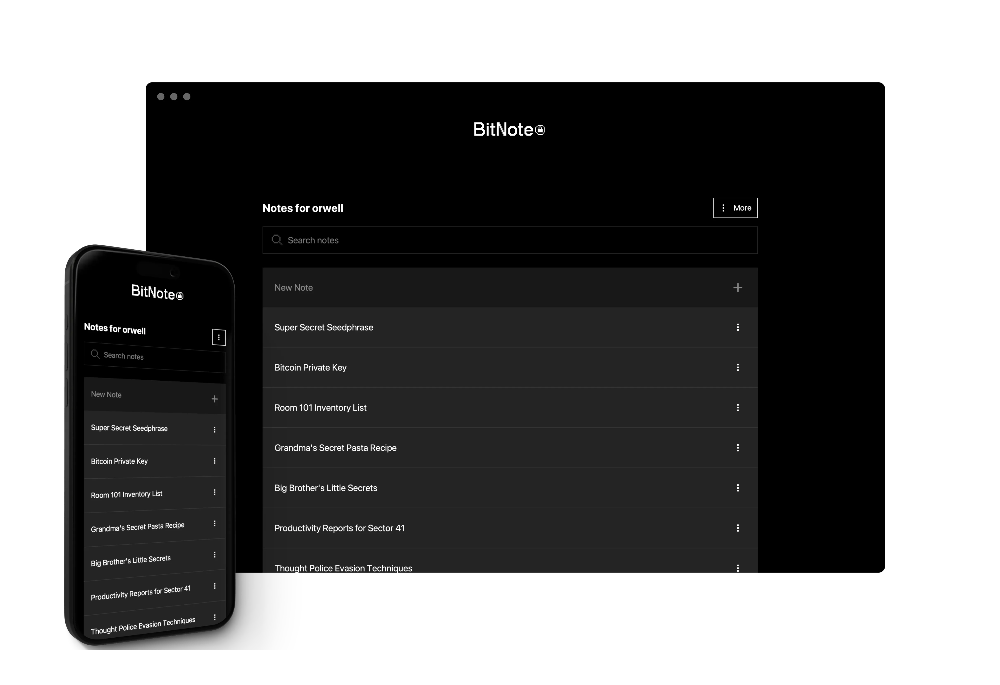
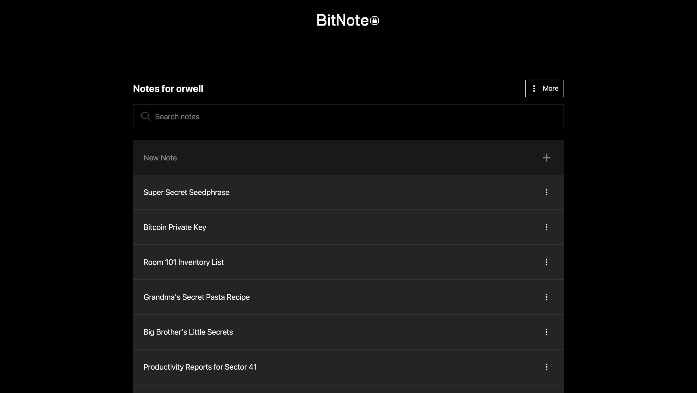
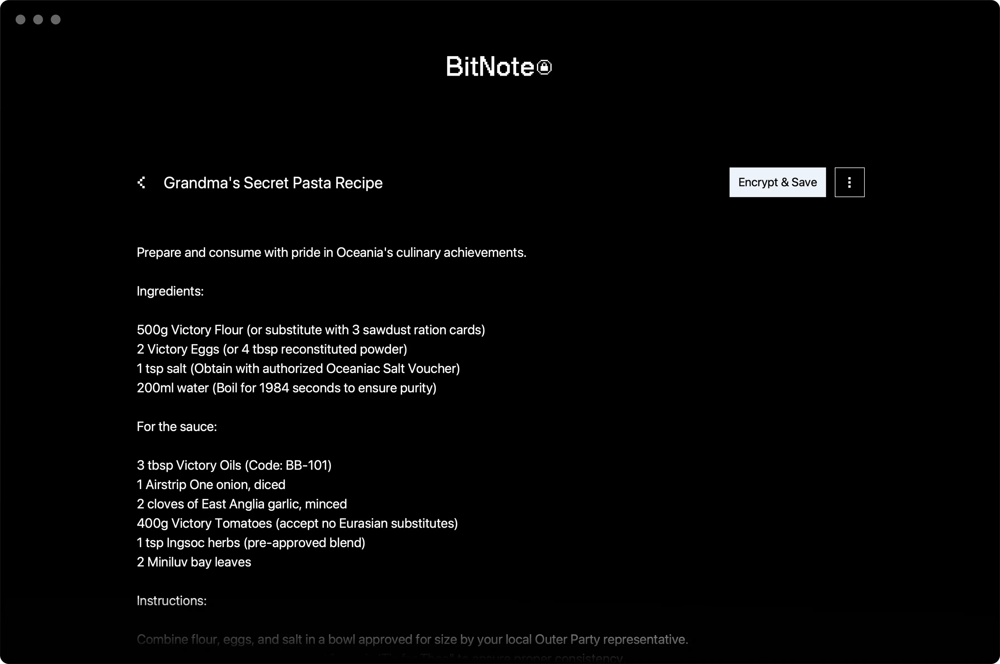
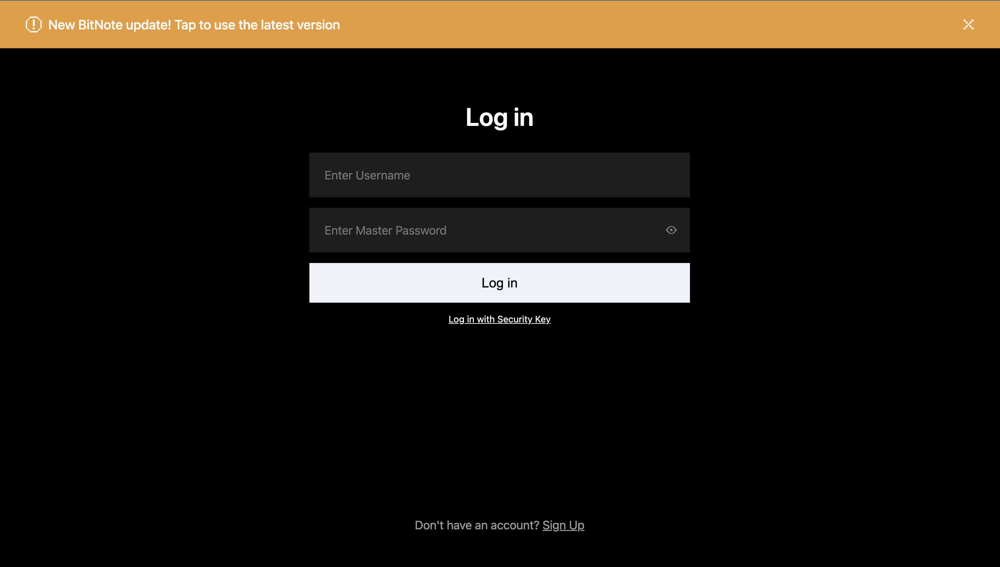
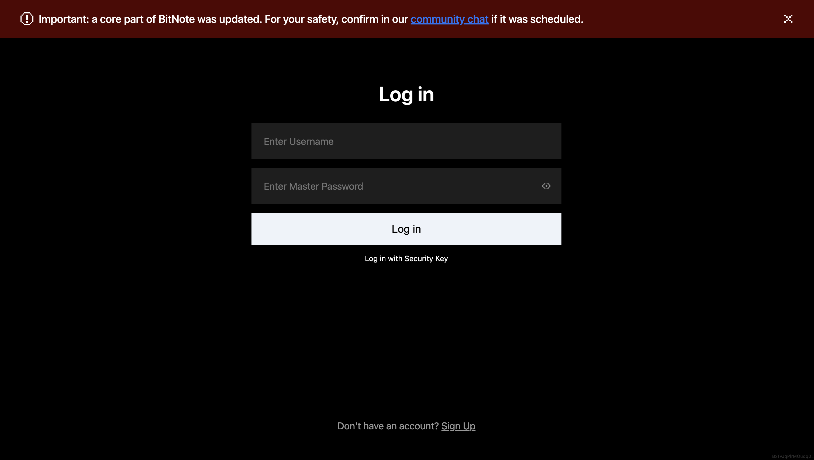
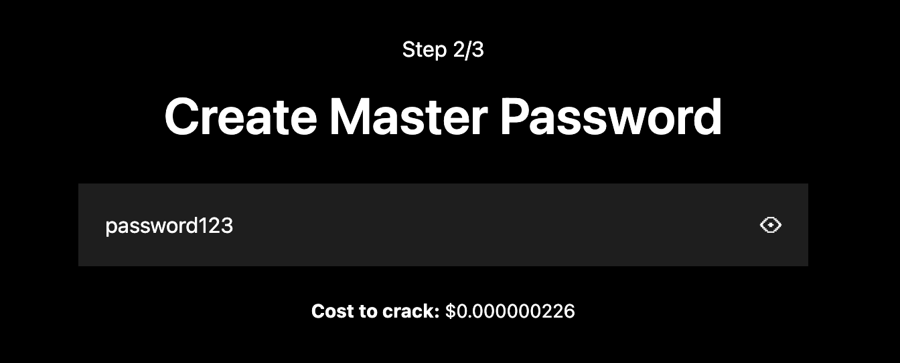

# 🔒 BitNote

**Protect Your Secrets. Forever.**  
Ultra-secure notes powered by blockchain.  
🔗 [bitnote.xyz](https://bitnote.xyz)

  

---

### ✅ Why BitNote

BitNote is built for people who want to store sensitive information without trusting big tech, subscriptions, or centralized servers. It’s like a fireproof vault that lives on the blockchain — without the hardware or the hassle. It's great for passwords, private keys, seedphrases, or other sensitive text data.

- ☑️ **Strong Security** — “Military Grade” encryption to keep your secrets safe.  
- ☑️ **No Recurring Fees** — pay once, no subscriptions.  
- ☑️ **Zero Knowledge & E2E Encrypted** — only you can see your data.  
- ☑️ **Decentralized** — no one can delete or block your access.  
- ☑️ **Truly Private** — no tracking, no personal data collection.  
- ☑️ **Transparent Source Code** — audit everything, trust nothing.
- ☑️ **Built to Last** — no bloat, no frameworks, engineered for longevity.
- ☑️ **Access Anywhere** — no sync, no setup. 
- ☐ **Succession *(In Development)*** — pass down your data automatically if something happens to you.

---

### ⚙️ How It Works

1. **Create Secure Notes**: Write your notes in the BitNote app. Your data is encrypted locally before being stored on the blockchain.

2. **Access Anywhere**: Retrieve your encrypted notes from any device with a browser. Decryption happens locally, ensuring privacy.

3. **Sharing & Succession**: Securely share notes with other BitNote users or set up succession rules to pass on your secrets under specific conditions.

---

### 🪧 Sign Up

After tapping [sign up](https://app.bitnote.xyz/?sign_up), you’ll be asked to create a unique username. Then you'll be presented with options on how you'd like to secure your account (either master password or security key). You’ll also be asked to fund your account to register your username and create notes on the blockchain. You can pay using crypto, credit, debit, or Apple Pay. You DO NOT need crypto to use BitNote. Once signed up, to access your encrypted notes just sign into BitNote with your credentials.

---

### 💵 Pricing

BitNote is a “pay as you go” system. No subscriptions or recurring fees. You pay only to create/edit/delete notes, and viewing notes is free.

Generally, it costs less than $1 to setup your account. Note costs vary by length, but it'll usually come in around ~$0.005, allowing you to create even thousands of notes cost effectively.

---

### 🌍 Use Cases

- Passwords
- Recovery codes 
- Private keys 
- Crypto seed phrases  
- Personal notes, ideas, and secrets meant to last
- Deadbox or dead man’s switch - storing information that you want passed down in case something happens to you.
- Digital treasure hunt - leave clues that lead people to the username and password that decrypts a BitNote account and reveals a prize.
- Private Journal - use BitNote as a diary that you can optionally pass down to future generations.
- Digital time capsule - create messages or store information intended to be accessed or opened far into the future.

---

### ✨ Features

| Feature | Description | Status |
|--------|-------------|--------|
| **Sharing** | Share your notes safely and easily with other BitNote users. | ✅ Available |
| **Local Client** | Run a copy of BitNote locally so you don’t have to rely on the website. | ✅ Available |
| **Cold Wallet Generator** | Easily create and store “cold” crypto wallets for long-term digital asset storage. | ✅ Available |
| **Import & Export** | Import and export your notes freely — your data is never locked in. | ✅ Available |
| **Keyboard Shortcuts** | Quickly search, create, and save notes using keyboard shortcuts. | ✅ Available |
| **Mobile App** | Use BitNote as a mobile app via your browser’s "Add to Homescreen" function. | ✅ Available |
| **Password & Passphrase Generator** | Quickly create secure passwords and passphrases | ✅ Available |
| **Referral System** | Earn 30% of protocol fees your referrals generate — automatically, forever. | ✅ Available |
| **Security Key Support** | Supports secure login via hardware keys (e.g., YubiKeys). | ✅ Available |
| **Secure Search** | Quickly search across your notes securely. | ✅ Available |
| **Offline Mode** | Use BitNote even while you're fully offline. | ✅ Available |
| **Secure Updater** | BitNote website updates are default opt-in, protecting you from supply chain attacks. | ✅ Available |
| **Backup Keys** | Add unlimited backup hardware security keys to access your account | ✅ Available |
| **Fiat Onramp** | Pay with Credit/Debit/Apple Pay | ✅ Available |
| **Decentralized App** | The entire app will be hosted on-chain for full decentralization. | 🕒 Upcoming |
| **Succession** | Pass down your data automatically if something happens to you | 🕒 Upcoming |

---

### 📺 Screenshots

  
  

---

### 🧱 Technical Overview

BitNote runs entirely in your browser on a client/blockchain model. Your notes are encrypted locally using AES-256 through the web crypto API and stored on-chain. Only you (and those you explicitly authorize) can decrypt it. No centralized servers. It's just you, your browser, and the blockchain.

For additional security, BitNote can be locally installed as a progressive web app on both desktop and mobile, can run offline, and requires explicit user opt-in for updates.

- **Frontend**: Pure HTML/CSS/JS — no frameworks, under 1MB  
- **Backend**: Smart contracts written in Solidity hosted on the Avalanche blockchain (C-Chain) 
- **Encryption**: AES-256 using the WebCrypto API, with a browser-based zero-knowledge architecture that supports full offline mode

---

### 🔐 How the Encryption Works

BitNote is end-to-end encrypted and zero knowledge. All encryption happens locally on your machine, and no one can see your data besides you.

After a user selects a username and master password, an account is generated with a secp256k1 key pair, EVM public address, and an ECDH p-521 key pair which is used for encrypting notes.

The master password is used to derive a key with pbkdf2-sha512 set to 1 million iterations, which is then used to encrypt the two private keys with AES-GCM using the outputted 256-bit key.

With the user’s public address as the index, the two private keys are encrypted on the blockchain, as well as the ECDH public key.

The username is hashed with keccak256 and the resulting hash is used as an index that points to the public address.

When the user logs into BitNote, the keys are retrieved, decrypted client side, and the ECDH key pair are utilized to decrypt the notes.

For additional security, all the client side computation is handled within a web worker.

> 🛡️ For added protection, **all cryptographic operations are run inside a web worker**, isolating them from the main thread.

---

### 🚨 Advanced Protection

While BitNote may look like a simple app, it has a number of advanced features that help protect you, including:

1. **Opt-In Updates**: BitNote updates are explicitly opt-in, meaning that you have to accept them before they happen. This gives you the opportunity to check to make sure the update is safe before applying it.

  

2. **Code Alert**: BitNote has a built in system to alert you if the version you have cached locally does not match what is being served to you through the web. This helps protect you against "supply chain attacks." If you ever see this alert come up on your app, please send a message through email/X/telegram and check BitNote's social channels to see if there is a legitimate reason for this before continuing to use the app.

  

3. **Cost to Crack**: If you choose to secure your account with a master password, we estimate your password strength with a “cost to crack” calculation that estimates how much an attacker would have to spend in compute resources to brute force your password.

  

---

### 📜 Smart Contracts

- **`mod_contract.sol`** – Main contract for the app, used to authorize others.  
  [View on Snowtrace](https://snowtrace.io/address/0x225AFdEb639E4cB7A128e348898A02e4730F2F2A)

- **`better_notes_contract.sol`** – Stores user notes.  
  [View on Snowtrace](https://snowtrace.io/address/0x3B0f15DAB71e3C609EcbB4c99e3AD7EA6532c8c9)

- **`sec_keys.sol`** – Stores user security keys.  
  [View on Snowtrace](https://snowtrace.io/address/0x78D35C5341f9625f6eC7C497Ed875E0dEE0Ef3Ac)

- **`authed_contract.sol`** – Inherited by the others to manage shared auth and variables.

---

### 🧩 Source Files & Hashes

These are the files that power BitNote, along with their SHA-256 hashes and links to verify integrity. [Generate hashes here.](https://app.bitnote.xyz/pages/hash_checker256/)

### 🔼 Launch Scripts
- **[`index_inline.js`](https://app.bitnote.xyz/pages/js/index_inline.js)** – Inlined JavaScript that initializes the app  
  `sha256-9f3K+SH47nSVfeCKjM/VYYBzHHgS46+NQJuU9oIp6nY=`

### 🔐 Encryption Engine
- **[`ww.js`](https://app.bitnote.xyz/pages/js/ww.js)** – Handles all encryption; runs in a dedicated web worker  
  `sha256-G1MiiPq/7Q46PppJHATljkf7tf8ln23NyFwUIjW91Pg=`

### 🌐 Service Layer
- **[`sw.js`](https://app.bitnote.xyz/sw.js)** – Service worker used for PWA support and request interception  
  `sha256-1uBYQMtnqb8J7BynjBqu8M9McU88ATeloN9PZsbqcvU=`

### 🧱 App Core
- **[`legacy_app.js`](https://app.bitnote.xyz/pages/js/legacy_app.js)** – The primary application logic and UI handling  
  `sha256-Nh9vxnofc31FBRHUJL8fbXDrF4p5K9Q11fdhOPZugUs=`

### 🔐 Password Utilities
- **[`zxcvbn.js`](https://app.bitnote.xyz/pages/js/zxcvbn.js)** – Password strength estimator  
  `sha256-FxuQZMMw/XFXhJnDHbjZcaFeiASfpTqEw0HPl5je6tg=`

- **[`new_wl.js`](https://app.bitnote.xyz/pages/js/new_wl.js)** – Expanded wordlist for generating secure passphrases  
  `sha256-iZzF53dvnO//nREcmPhEgwO9G/5Mq7UU8oihLCNltoo=`

### 🎨 Styling
- **[`index_inline.css`](https://app.bitnote.xyz/pages/css/index_inline.css)** – Critical CSS loaded with the main page  
  `sha256-cNpabiKA16hSe3b3kmJzD2KUTljZLFPCTEe+2/6dZ8c=`

- **[`legacy_app.css`](https://app.bitnote.xyz/pages/css/legacy_app.css)** – Remaining styles used across the app  
  `sha256-Qh+toqfaD45xkc+pd3HKOTjXwdYyRefN8mhrnjgnYas=`

### 🛡️ Raw Content Security Policy Header

- `default-src 'self'; connect-src 'self' https://api.avax-test.network https://ava-testnet.public.blastapi.io https://api.avax.network https://avalanche-c-chain-rpc.publicnode.com https://avax.meowrpc.com https://endpoints.omniatech.io https://1rpc.io https://api.coinbase.com; script-src 'strict-dynamic' 'sha256-9f3K+SH47nSVfeCKjM/VYYBzHHgS46+NQJuU9oIp6nY=' 'sha256-G1MiiPq/7Q46PppJHATljkf7tf8ln23NyFwUIjW91Pg=' 'sha256-1uBYQMtnqb8J7BynjBqu8M9McU88ATeIoN9PZsbqcvU=' 'sha256-Nh9vxnofc31FBRHUJL8fbXDrF4p5K9Q11fdhOPZugUs=' 'sha256-FxuQZMMw/XFXhJnDHbjZcaFeiASfpTqEw0HPl5je6tg=' 'sha256-iZzF53dvnO//nREcmPhEgwO9G/5Mg7UU8oihLCNItoo='; style-src 'sha256-cNpabiKA16hSe3b3kmJzD2KUTljZLFPCTEe+2/6dZ8c=' 'sha256-Qh+toqfaD45xkc+pd3HKOTjXwdYyRefN8mhrnjgnYas=';worker-src 'self' blob:;img-src 'self' data:;`

- `sha256-GtQnJ0eyKFJCKBM7Gv2TToW1Vu0JsCoDfjcHY6WILSg=`

---

### 🔍 Is BitNote Audited?

Yes. BitNote has been audited by Cure53, a very reputable cybersecurity firm.

- [Summary of the Audit](https://app.bitnote.xyz/pages/docs/rve-01-summary.pdf)  
- [Full Audit Report](https://app.bitnote.xyz/pages/docs/rve-01-report_final.pdf)

---

### 🔐 License

BitNote is licensed under BSL 1.1. It will automatically trigger an open source transition to GPL v3.0 on **May 1, 2028**.  
[Read the full license](https://bitnote.xyz/license)

---

### 🌐 Visit BitNote

[https://bitnote.xyz](https://bitnote.xyz)

